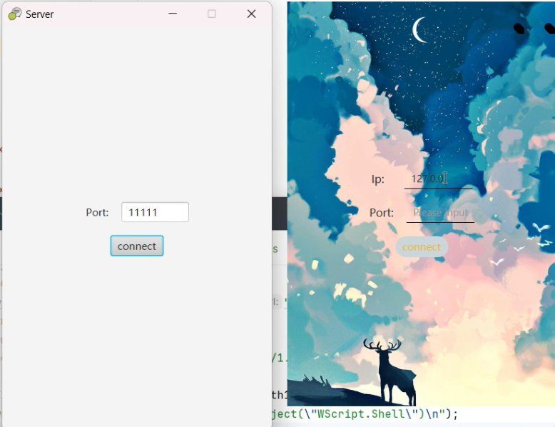
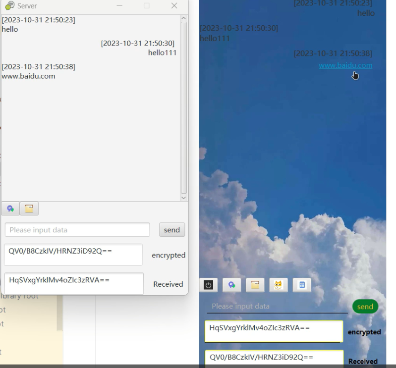
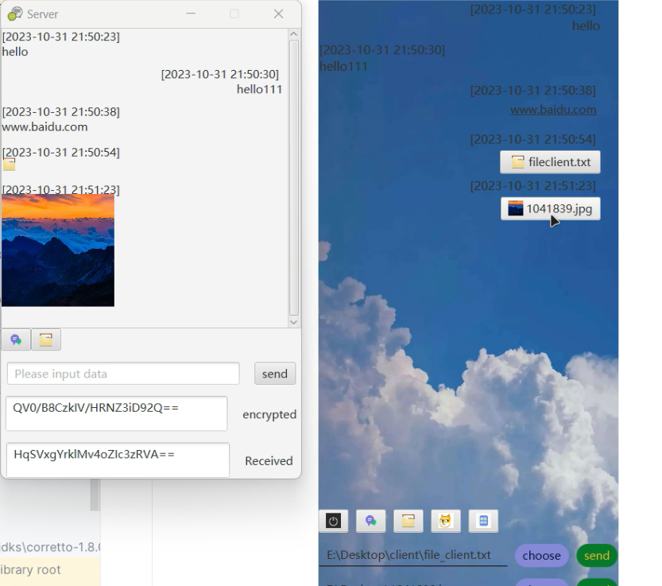
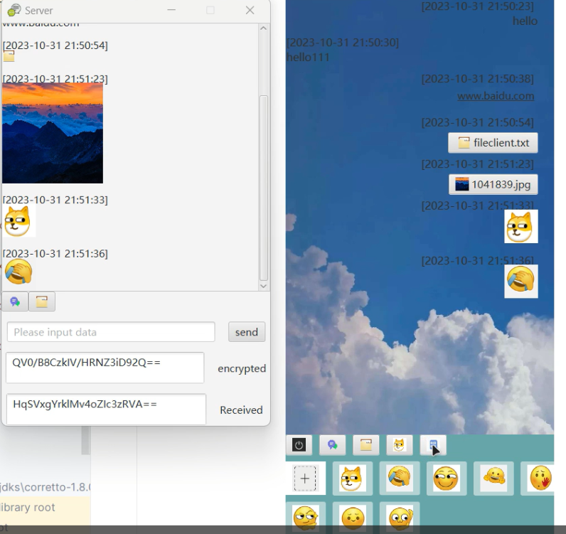
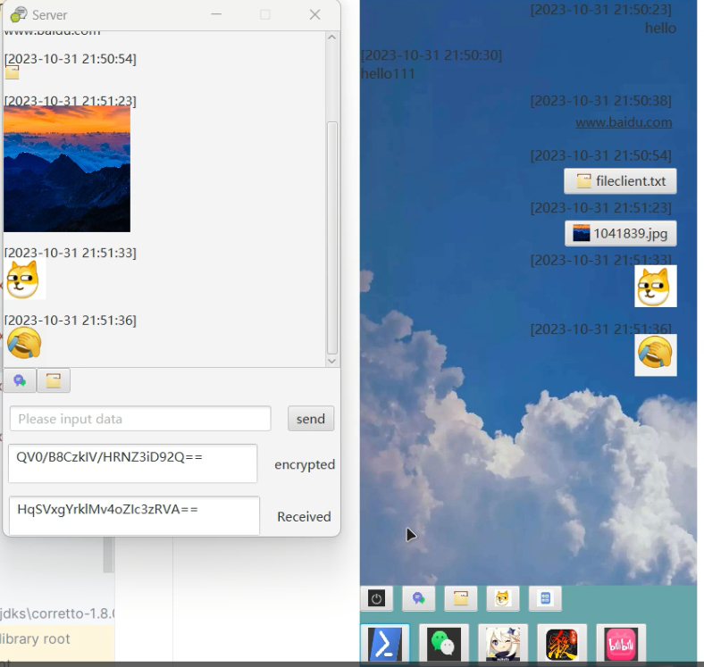

# Simple-Chatroom

一个基于JavaFX实现的P2P在线聊天室 
它包含Client和Server两部分，您需要使用这两份代码创建两个项目，然后再分别运行他们 
因为只用了3、4天的时间准备，所以代码没有经过优化(重复部分全是复制粘贴)，然后我们实现的功能如下: 
> 发送消息 
    发送网址并跳转 
    发送文件，图片并打开 
    发送表情包 
    重启聊天室 
接入星火认知大模型 
快捷程序启动 

因为这里面很多都是用的我的绝对路径，所以你们可能需要修改以下路径。 
最后贴一下运行截图: 

